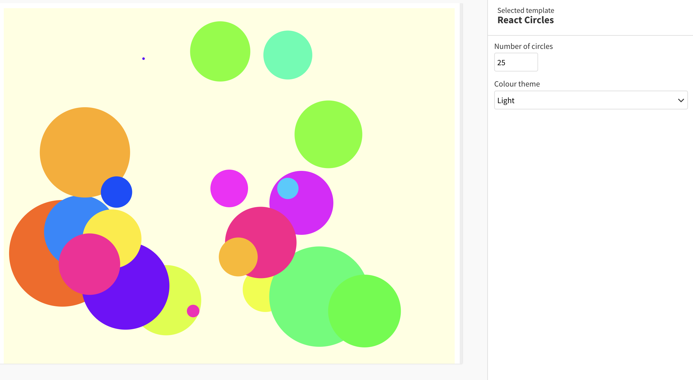

# Example Flourish React template

This simple example uses React to draw a specified number of colorful circles at random positions, radii & colors. It demonstrates the use of settings in a React context.

## How this works

- `template.yml` has settings for the number of circles and theme
- In `src/App.jsx` an SVG is created with specified theme, drawing the specified number of circles with randomised positions, radii & colors

## How to run this

- [Install Flourish](https://flourish.studio/developers/) and use `flourish run` to run the template
- More info about publishing a template to Flourish [can be found here](https://flourish.studio/developers/quickstart/publish-to-flourish/)